Author : [Srinikethan Mankala
](sriz1392@gmail.com)
#  *Self Driving Cars* 
  

<!-- TOC -->
<H2> Table of Contents</H2>

* [Module-1](https://github.com/srini1392/Self-Driving-Cars#Course-1-:-Introduction-to-Self-driving-Cars)
    * [Glossary of Terms](https://github.com/srini1392/Self-Driving-Cars#Glossary-of-Terms)
    * [Taxonomy](https://github.com/srini1392/Self-Driving-Cars#Taxonomy)
    * [Hardware-Architecture](https://github.com/srini1392/Self-Driving-Cars#Hardware-Architecture)
    * [Software-Architecture](https://github.com/srini1392/Self-Driving-Cars#Software-Architecture)
    * [Environment-Perception](https://github.com/srini1392/Self-Driving-Cars#Environment-Perception)

<!-- stop TOC -->

<!-- Chapter 1 -->
<H2> Course 1 : Introduction to Self driving Cars</H2>

<!-- Glossary -->
<H2> Glossary of Terms</H2>

* *__ACC: Adaptive Cruise Control__* 
    A cruise control system for vehicles which controls longitudinal speed. ACC can maintain a desired reference speed or adjust its speed accordingly to maintain safe driving distances to other vehicles.

* *__Ego__* 
    A term to express the notion of self, which is used to refer to the vehicle being controlled autonomously, as opposed to other vehicles or objects in the scene. It is most often used in the form ego-vehicle, meaning the self-vehicle.

* *__FMEA: Failure Mode and Effects Analysis__* 
    A bottom up approach of failure analysis which examines individual causes and determines their effects on the higher level system.

* *__GNSS: Global Navigation Satellite System__* 
    A generic term for all satellite systems which provide position estimation. The Global Positioning System (GPS) made by the United States is a type of GNSS. Another example is the Russian made GLONASS (Globalnaya Navigazionnaya Sputnikovaya Sistema).

* *__HAZOP: Hazard and Operability Study__* 
    A variation of FMEA (Failure Mode and Effects Analysis) which uses guide words to brainstorm over sets of possible failures that can arise.

* *__IMU: Inertial Measurement Unit__* 
    A sensor device consisting of an accelerometer and a gyroscope. The IMU is used to measure vehicle acceleration and angular velocity, and its data can be fused with other sensors for state estimation.

* *__LIDAR: Light Detection and Ranging__*  
    A type of sensor which detects range by transmitting light and measuring return time and shifts of the reflected signal.

* *__LTI: Linear Time Invariant__* 
    A linear system whose dynamics do not change with time. For example, a car using the unicycle model is a LTI system. If the model includes the tires degrading over time (and changing the vehicle dynamics), then the system would no longer be LTI.

* *__LQR: Linear Quadratic Regulation__* 
    A method of control utilizing full state feedback. The method seeks to optimize a quadratic cost function dependent on the state and control input.

* *__MPC: Model Predictive Control__* 
    A method of control whose control input optimizes a user defined cost function over a finite time horizon. A common form of MPC is finite horizon LQR (linear quadratic regulation).

* *__NHTSA: National Highway Traffic Safety Administration__* 
    An agency of the Executive Branch of the U.S. government who has developed a 12-part framework to structure safety assessment for
    autonomous driving.The framework can be found here.  
    https://www.nhtsa.gov/sites/nhtsa.dot.gov/files/documents/13069a-ads2.0_090617_v9a_tag.pdf

* *__ODD: Operational Design Domain__* 
    The set of conditions under which a given system is designed to function. For example, a self driving car can have a control system designed for driving in urban environments, and another for driving on the highway.

* *__OEDR: Object and Event Detection and Response__* 
    The ability to detect objects and events that immediately affect the driving task, and to react to them appropriately.

* *__PID: Proportional Integral Derivative Control__* 
    A common method of control defined by 3 gains.

    1) A proportional gain which scales the control output based on the amount of the error

    2) An integral gain which scales the control output based on the amount of accumulated error

    3) A derivative gain which scales the control output based on the error rate of change

* *__RADAR: Radio Detection And Ranging__* 
    A type of sensor which detects range and movement by transmitting radio waves and measuring return time and shifts of the reflected signal.

* *__SONAR: Sound Navigation And Ranging__* 
    A type of sensor which detects range and movement by transmitting sound waves and measuring return time and shifts of the reflected signal.
   

<!-- Taxonomy -->
<H2> Taxonomy</H2>

1. <H4>Driving task</H4>

    ___Perceiving the environment___
    >>
        This includes tracking a car's motion in identifying the various elements in the world around us,
        like the road surface, road signs,vehicles, pedestrians and so on. 
        Need to track all moving objects and predict their future motions.
    >>

    ___Motion Planning___
    >>
        This allows us to reach our destination successfully. 
        For example you may want to drive from your home to your office. 
        So you'll need to consider which roads you should take,when you should change lanes or 
        cross an intersection and how to execute a swerve maneuver around a pothole along the way.
    >>

    ___Driving Vehicle itself___
    >>
        Appropriate steering, break and acceleration decisions to control the vehicle's 
        position and velocity on the road. 
    >>

    ___Operational Design Domain (ODD)___
    >>
        The ODD constitutes the operating conditions under which a given system is designed to function. 
        It includes environmental, time of day,roadway and other characteristics under 
        which the car will perform reliably.Clearly defining the operating conditions for which 
        a self-driving car is designed, is crucial to ensuring the safety of the system
    >>

    ___Classify Driving System Automation___
    >>
         -> Driver attention requirements
  
         -> What exactly makes up a driving task?
            1. Lateral control - task of steering laterally on the road.
               i.e, turning left, right,tackling curve etc.

            2. OEDR (Object & Event Detection & Response)- OEDR is essentially the ability to detect 
               objects and events that immediately affect the driving task and to react to them appropriately

            3. Planning - Is primarily concerned with the long and short term plans needed to travel
               to a destination or execute maneuvers such as lane changes and intersection crossings.

            4. Miscellaneous tasks -signaling with indicators, hand-waving,interacting with other drivers etc
    >>

    ___Levels of Automation___
    >>
         1. Level 0 - *No automation*
         2. Level 1 - *Driving Assistance* - Lateral or Logitudinal control 
                       (Ex. Adaptive Cruise Control, Lane Keep Assist)
         3. Level 2 - *Partial Automation Driving* - Lateral & Logitudinal control by system
                        (ex. GM super cruise, Nissan pro-pilot)
         4. Level 3 - *Condition Driving Automation* - Longitudinal, lateral and OEDR 
                        (Driver needs to take control when system fails)(Ex. Audi A8 sedan)
         5. Level 4 - *High Driving automation* - Lateral, longitudinal, OEDR, fallback s/m (Ex. Waymo)
         6. Level 5 - *Fully Autonomous* - All control by system, Lateral,longitudinal,OEDR, unlimited ODD
    >>
 

2. <H4> Perception Task </H4>

    In particular, for any agent or element on the road, we need to first identify what it is; a car, a cyclist, a bus, etc. And second, we want to understand its motion; has it been moving in a certain way that can tell us what it will do next. It's still difficult for computer systems to be able to recognize these same patterns around us as quickly. 
     
    >>
                     _ _ _ _ _ _ _ _ _ _ _       _ _ _ _ _ _ _ _ _ _ _
                    |  Analyze ego motion |     |  Decide on and      |
                    |       &             |     |  Plan a Maneuver    |
        Input--->   |   environment       |---> |   (planning)        | ---> Drive
                    |   (perception)      |     |                     |
                    |_ _ _ _ _ _ _ _ _ _ _|     |_ _ _ _ _ _ _ _ _ _ _|
    >>

    ___Various elements in perception___
    >>
        a. Static elements
           1. roads and lane markings
           2. zebra crossings
           3. off-road elements like curbs
           4. on-road traffic signals 
           5. road obstructions
           6. cones used while construction
    
        b. Dynamic elements
           1. Other vehicles (motorcycles, 4 wheelers, trucks etc.)
           2. pedestrians
    
        c. Ego Localization
           1. Position (gps)
           2. velocity, acceleration (imu)
           3. Orientation, angular motion (odometry sensors)
    >>

    ___Challenges to Perception___
    >>
        a. Robust detection and segmentation
        b. Sensor uncertainity
        c. Occlusion & reflection (camera data)
        d. Illumination, lens flare
        e. Weather & precipitation
    >>
   

<!-- Hardware Architecture -->
<H2> Hardware Architecture</H2>

Most commonly available sensors:
1. Stereo Camera for depth information
2. LiDAR for 3D input
3. RADAR
4. Ultrasonic for short range
5. GNSS/IMU data
6. Wheel Speed Sensors

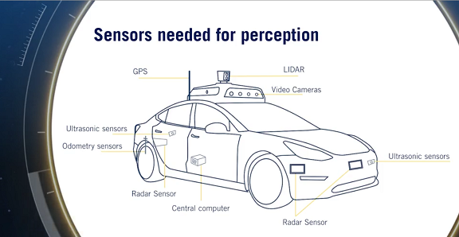

- __Deceleration Rates__:
    - Aggressive deceleration       - 5 m/$s^2$
    - Nomral /Comfort deceleration  - 2 m/$s^2$

- __Stopping distance__ is given as 
d = $V^2$ / 2a
 where d = distance, V is vehicle speed, a is rate of deceleration

>>
    NOTE:   A wide 160 to 180 degree field of view is required to track adjacent lanes and 
            a range of 40 to 60 meters is needed to find space between vehicles.
>>
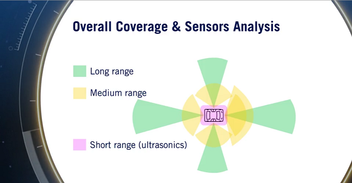
   

<!-- Software Architecture -->
<H2> Software Architecture</H2>

*__Software Stack__* comprises of: 
1. Environment Perception
2. Environment Mapping
3. Motion Planning
4. Controller
5. System Supervisor

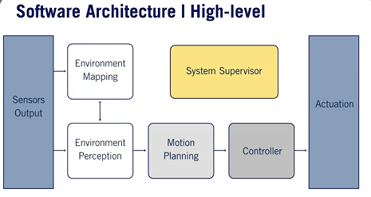
  

<H4>1. Environment Perception</H4>

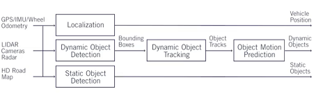
 
There are two important parts of the perception stack, localizing the ego-vehicle in space, as well as classifying &
locating the important elements of the environment. The localization module takes in multiple streams of information, 
such as the current GPS location, IMU measurements and wheel odometry. It then combines them to output an accurate vehicle location. 
For greater accuracy, some localization modules also incorporate LIDAR and camera data.

Typically, the problem of classification and localization of the environmental elements is divided into two segments, 
- *<H5>Detecting dynamic objects in the environment</H5>*
       The dynamic object detection module uses a set of camera inputs as well as LIDAR point clouds to create 3D bounding boxes 
       around dynamic objects in the scene. The 3D bounding boxes encode the class or type of object as well as the exact position, 
       orientation and size of the object. Once detected, the dynamic objects are tracked over time by a tracking module. 
       The tracker module provides not only the current position of the dynamic objects but also the history 
       of its path through the environment. The history of the path is used along with the roadmaps In order to predict the future path 
       of all dynamic objects.This is usually handled by a prediction module, which combines all information regarding the dynamic 
       object and the current environment to predict the path of all dynamic objects
       
- *<H5>Detecting the static objects in the environment</H5>*
       Relies on a combination of camera input and LIDAR data to identify significant static objects in the scene. 
       Such important data include the current lane in   which the self-driving vehicle is found, and the location of regulatory 
       elements such as signs and traffic lights.

<H4>2. Environment Mapping</H4>
    Environment maps create several different types of representation of the current environment around the autonomous car. 
    There are three types of maps: 

- __Occupancy grid map__  
    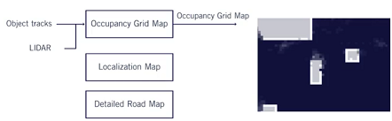 
    Map of all static objects in environment (LiDAR is used)    

- __Localization Map__  
    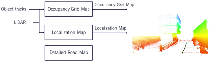 
    (LiDAR,Camera) for Ego localization & estimation    

- __Detailed road Map__  
    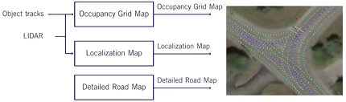 
        Road segments which represent the driving environment. It captures signs and lane 
        markings in a manner that can be used for motion planning     

<H4>3. Motion Planning </H4>
    Motion planning for self-driving cars is a challenging task, and it's hard to solve in a single integrated process. 
    Instead, most self-driving cars today use a decomposition that divides the problem into several layers of abstraction

- __Mission Planner__

    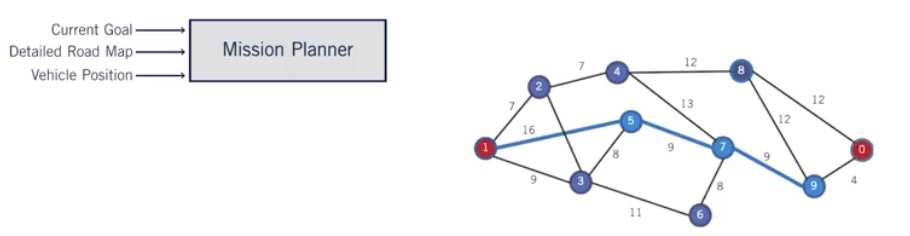  

    At the top level, the mission planner handles long term planning and defines the mission over the entire 
    horizon of the driving task, from the current location, through the road network to its final destination. 
    To find the complete mission, the mission planner determines the optimal sequence of road segments that
    connect your origin and destination, and then passes this to the next layer.
        

- __Behavior Planner__

    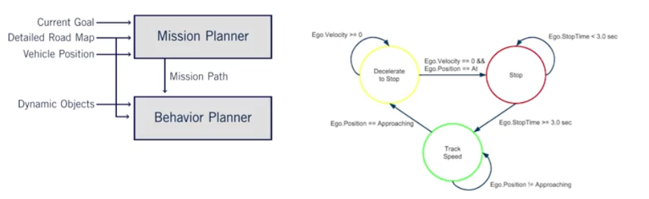  

    The behaviour planner is responsible for establishing a set of safe actions or maneuvers to be executed 
    while travelling along the mission path. An example of the behaviour planner decisions would be whether 
    the vehicle should merge into an adjacent lane given the desired speed and the predicted behaviors 
    of nearby vehicles.Along with the maneuver of decisions, the behavior planner also provides a set of 
    constrains to execute with each action, such as how long to remain in the current lane before switching.
        

- __Local Planner__

    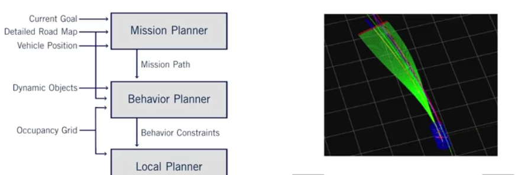  
    It performs immediate or reactive planning, and is responsible for defining a specific path and velocity 
    profile to drive. The local plan must be smooth, safe, and efficient given all the current constraints 
    imposed by the environment and maneuver. In order to create such a plan, the local planner combines 
    information provided by the behavior planner, occupancy grid, the vehicle operating limits, and other 
    dynamic objects in the environment. The output of the local planner is a planned trajectory which is a 
    combined desired path and velocity profile for a short period of time into the future.
        

<H4>4. Vehicle Controller </H4>

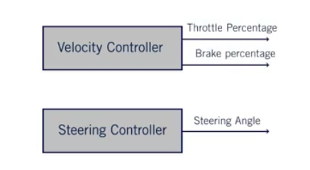  
    A typical controller separates the control problem into a longitudinal control and a lateral control. 
    The *__lateral controller__* outputs the steering angle required to maintain the planned trajectory,  
    whereas the *__longitudinal controller__* regulates the throttle, gears and braking system to achieve 
    the correct velocity. Both controllers calculate current errors and tracking performance of the 
    local plan, and adjust the current actuation commands to minimize the errors going forward. 

<H4>5. System Supervisor </H4>
    System supervisor is the module that continuously monitors all aspects of the autonomous car and gives the appropriate warning in the event of a subsystem failure. There are two parts:  

- __Hardware supervisor__

    Continuously monitors all hardware components to check for any faults, such as a broken sensor, a missing measurement, or degraded information. Another responsibility of the hardware supervisor is to continuously analyze the hardware outputs for any outputs which do not match the domain which the self-driving car was programmed to perform under. 
    Ex: if one of the camera sensors is blocked by a paper bag or if snow is falling and corrupting the LIDAR point cloud data. 

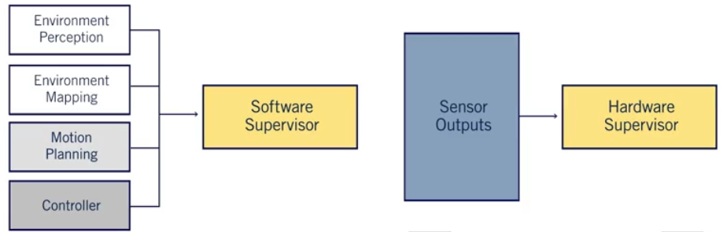  

- __Software supervisor__

    Responsibility of validating this software stack to make sure that all elements are running as intended at the right frequencies and providing complete outputs. The software supervisor also is responsible for analyzing inconsistencies between the outputs of all modules. In this video, we looked at the basic software architecture of a typical self-driving software system.

<!--Environment Perception  -->
<H2>Environment Perception</H2>

* *__Localization Map__* 
    This map is created using a continuous set of lidar points or camera image features as the car moves through the enviromment.
    This map is then used in combination with GPS, IMU and wheel odometry by the localization module To accurately estimate the precise location of the vehicle at all times.
    The localization map uses recorded LIDAR points or images, which are combined to make a point cloud representation of the environment. As new LIDAR camera data is received it is compared to the localization map and a measurement of the eagle vehicles position is created by aligning the new data with the existing map.
    This measurement is then combined with other sensors to estimate eagle motion and ultimately used to control the vehicle.

* *__Occupancy grid Map__*  
    The occupancy grid also uses a continuous set of LIDAR points to build a map of the environment which indicates the location of all static, or stationary, obstacles. 
    This map is used to plan safe, collision-free paths for the autonomous vehicle.
    The occupancy grid is a 2D or 3D discretized map of the static objects in the environments surrounding the eagle vehicle. This map is created to identify all static objects around the autonomous car, once again, using point clouds as our input.
    The objects which are classified as static include trees, buildings, curbs, and all other nondriveable surfaces. 
    As the occupancy grid only represents the static objects from the environment, all dynamic objects must first be removed. This is done by removing all lidar points that are found within the bounding boxes of detected dynamic objects identified by the perception stack.
    Next, static objects which will not interfere with the vehicle are also removed. Such as dryable service or any over hanging tree branches. As result of these steps only the relevent writer points from static objects from the environment remain.
    The occupancy grid, therefore, represents the environment probabilistically, by tracking the likelihood that a grid cells occupy over time.
    This map is then relied on to create paths for the vehicle which are collusion-free.

* *__Detailed road Map__* 
    It contains detailed positions for all regulatory elements, regulatory attributes and lane markings. This map is used to plan a path from the current position to the final destination.
    is a map of the full road network which can be driven by the self-driving car.
    This map contains information regarding the lanes of a road, as well as any traffic regulation elements which may affect them.
    The detailed road map is used to plan a safe and efficient path to be taken by the self-driving car.
    The detailed road map can be created in one of three ways. Fully online, fully offline, or created offline and updated online.
    A map which is created fully online relies heavily on the static object proportion of the perception stack to accurately label and correctly localize all relevant static objects to create the map.
    This includes all lane boundaries in the current driving environment, any regulation elements, such as traffic lights or traffic signs, any regulation attributes of the lanes, such as right turn markings or crosswalks.
    This method of map creation is rarely used due to the complexity of creating such a map in real time.
    A map which is created entirely offline is usually done by collecting data of a given road several times. Specialized vehicles with high accuracy sensors are driven along roadways regularly to construct offline maps. Once the collection is complete, the information is then labelled with the use of a mixture of automatic labelling from static object perception and human annotation and correction.